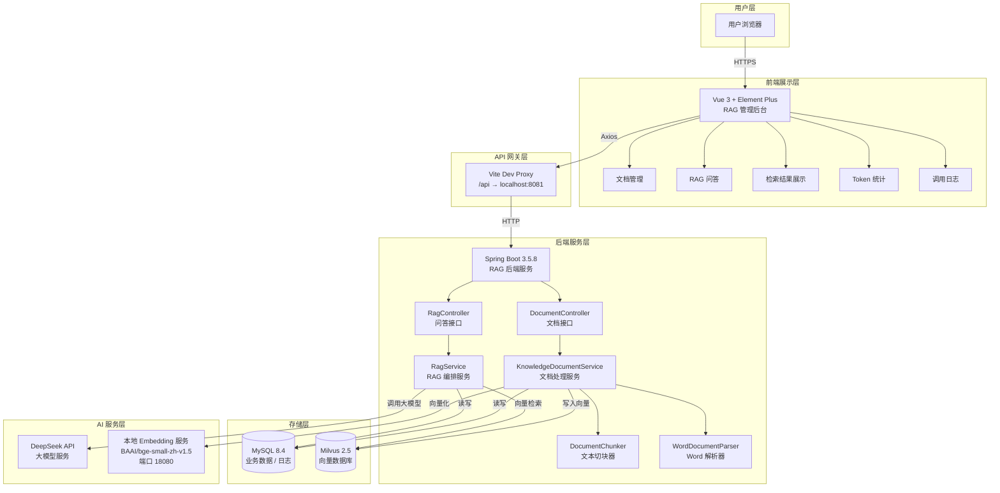
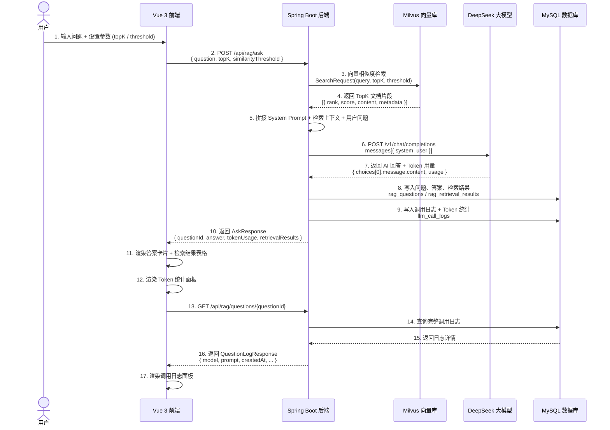

# RAG 知识库问答系统

一个完整可运行的 RAG（Retrieval-Augmented Generation，检索增强生成）知识库问答系统，包含后端服务和前端管理界面。

## 项目简介

本项目是一个全栈 RAG 系统，适用于学习和演示 RAG 的核心流程与能力：

- **文档管理**：支持文本和 Word 文件上传，自动向量化入库
- **RAG 问答**：基于向量检索的智能问答，回答结果可追溯
- **检索可视化**：展示 TopK 命中片段及相似度评分
- **Token 统计**：记录每次调用的输入 / 输出 / 总 Token 用量
- **调用日志**：完整记录 prompt、模型、时间戳等审计信息

**RAG 核心流程：**

```
文档上传 → 智能切块 → Embedding 向量化 → 写入向量库 → 用户提问 → 向量检索
→ 召回 TopK 片段 → 拼接 Prompt → 调用大模型 → 返回 AI 回答 → 日志落库 + Token 统计
```

## 架构说明



## RAG 调用流程图

下图展示一次完整问答请求的全链路流程：



## 技术选型

| 技术 | 作用 | 选择原因 |
|------|------|----------|
| **Vue 3** | 前端框架 | Composition API + `<script setup>` 语法，代码简洁可读 |
| **TypeScript** | 类型安全 | 编译期类型检查，减少运行时错误 |
| **Vite** | 构建工具 | 极快的热更新和构建速度，原生 ESM 支持 |
| **Element Plus** | UI 组件库 | 丰富的中文场景组件，成熟的表单/表格/布局支持 |
| **@element-plus/icons-vue** | 图标库 | 与 Element Plus 深度集成，按需引入 |
| **Vue Router** | 路由管理 | 官方路由方案，支持懒加载 |
| **Axios** | HTTP 客户端 | 请求/响应拦截器，统一错误处理 |
| **Spring Boot 3.5.8** | 后端框架 | 成熟的 Java 生态，丰富的 Starter 集成 |
| **Spring AI 1.1.2** | AI 编排框架 | 统一 API 调用 Chat/Embedding/VectorStore |
| **MyBatis-Plus** | ORM 框架 | Lambda 查询 + 自动分页，比 JPA 更灵活 |
| **MySQL 8.4** | 业务数据库 | 存储文档、问答记录、日志等结构化数据 |
| **Milvus 2.5** | 向量数据库 | 高性能相似度检索，支持混合搜索 |
| **DeepSeek API** | 大模型服务 | OpenAI 兼容接口，中文理解能力强，性价比高 |
| **BAAI/bge-small-zh-v1.5** | Embedding 模型 | 中文语义向量化，512 维轻量高效 |
| **sentence-transformers** | 本地 Embedding | Python 库，支持 MPS 加速 |
| **FastAPI + Uvicorn** | Embedding 服务 | 高性能异步 Python HTTP 服务 |
| **Apache POI** | Word 文档解析 | 支持 .docx 和 .doc 格式文本提取 |
| **Mermaid** | 架构图渲染 | Markdown 原生支持，文本描述即可生成图表 |

## 功能模块

### 后端核心模块

| 模块 | 说明 |
|------|------|
| **文档管理** | 支持 JSON 文本和 Word 文件（.docx / .doc）上传，自动切块并写入向量库 |
| **文档切块** | `DocumentChunker` 智能分块，优先在自然语义边界（换行、句号、问号等）处切分 |
| **向量检索** | 基于 Milvus 的相似度检索，返回 topK 文档片段及评分 |
| **RAG 问答** | 检索上下文 + System Prompt 约束 + 大模型生成答案 |
| **调用日志** | 每次问答完整记录 prompt、答案、模型、Token 用量到 MySQL |
| **Token 统计** | 自动解析 API 返回的 `usage` 字段，落库输入/输出/总 Token |
| **日志查询** | 支持按 questionId 回溯任意一次问答的完整调用链路 |

### 前端功能模块

| 模块 | 说明 |
|------|------|
| **文档管理** | JSON 文本上传 + Word 文件拖拽上传，文档列表展示（ID、标题、切块数、时间） |
| **预设问题** | 5 个 RAG 常见问题一键填入，快速体验问答效果 |
| **参数调节** | 可调节 topK（1-20）和相似度阈值（0.1-1.0），控制检索范围 |
| **AI 回答展示** | 答案卡片展示，支持一键复制 |
| **检索结果表格** | 命中片段排名、相似度评分（颜色标记）、来源文档、片段内容 |
| **Token 统计面板** | 输入/输出/总 Token 数字面板可视化 |
| **调用日志面板** | 问题 ID、模型名称、调用时间、完整 Prompt 展示 |
| **统一错误处理** | Axios 拦截器统一弹窗提示，用户体验友好 |

## 项目目录结构

```text
rag/
├── src/main/java/com/example/rag/       # 后端 Java 源码
│   ├── RagApplication.java              # Spring Boot 入口
│   ├── config/                          # 配置类
│   │   ├── RagConfig.java
│   │   └── RagProperties.java
│   ├── controller/                      # REST 控制器
│   │   ├── DocumentController.java      # 文档管理接口
│   │   └── RagController.java           # RAG 问答接口
│   ├── dto/                             # 请求/响应 DTO
│   │   ├── AskRequest.java
│   │   ├── AskResponse.java
│   │   ├── DocumentItemResponse.java
│   │   ├── IngestDocumentRequest.java
│   │   ├── IngestDocumentResponse.java
│   │   ├── QuestionLogResponse.java
│   │   ├── RetrievalHitResponse.java
│   │   └── TokenUsageResponse.java
│   ├── entity/                          # 数据表实体
│   │   ├── TKnowledgeDocument.java
│   │   ├── TLlmCallLog.java
│   │   ├── TRagQuestion.java
│   │   └── TRagRetrievalResult.java
│   ├── mapper/                          # MyBatis-Plus Mapper
│   │   ├── TKnowledgeDocumentMapper.java
│   │   ├── TLlmCallLogMapper.java
│   │   ├── TRagQuestionMapper.java
│   │   └── TRagRetrievalResultMapper.java
│   └── service/                         # 业务服务层
│       ├── DocumentChunker.java         # 文本智能切块器
│       ├── WordDocumentParser.java      # Word 文档解析器
│       ├── KnowledgeDocumentService.java
│       ├── RagService.java
│       └── impl/
│           ├── KnowledgeDocumentServiceImpl.java
│           └── RagServiceImpl.java
├── src/main/resources/
│   ├── application.yml                  # 应用配置
│   └── db/schema.sql                    # 数据库 DDL
├── src/test/                            # 测试代码
├── rag-frontend/                        # Vue 3 前端项目
│   ├── index.html                       # 入口 HTML
│   ├── package.json                     # 依赖配置
│   ├── vite.config.ts                   # Vite 构建配置
│   ├── tsconfig.json                    # TypeScript 配置
│   ├── tsconfig.app.json
│   ├── tsconfig.node.json
│   ├── public/                          # 静态资源
│   │   └── favicon.svg
│   └── src/
│       ├── main.ts                      # 应用入口
│       ├── App.vue                      # 根组件
│       ├── api/                         # API 调用层
│       │   ├── client.ts                # Axios 实例 + 拦截器
│       │   ├── document.ts              # 文档接口
│       │   └── rag.ts                   # RAG 问答接口
│       ├── assets/                      # 静态资源
│       ├── components/                  # 组件
│       │   ├── layout/                  # 布局组件
│       │   │   ├── AppLayout.vue        # 整体布局
│       │   │   ├── AppHeader.vue        # 顶部标题栏
│       │   │   └── AppSidebar.vue       # 侧边导航栏
│       │   ├── document/                # 文档管理组件
│       │   │   ├── DocumentUpload.vue   # 文档上传
│       │   │   └── DocumentList.vue     # 文档列表
│       │   └── rag/                     # RAG 问答组件
│       │       ├── PresetQuestions.vue  # 预设问题
│       │       ├── ParameterPanel.vue   # 参数面板
│       │       ├── ChatInput.vue        # 问题输入
│       │       ├── AnswerCard.vue       # AI 答案卡片
│       │       ├── RetrievalResultsTable.vue  # 检索结果表格
│       │       ├── TokenUsageCard.vue   # Token 统计面板
│       │       └── CallLogPanel.vue     # 调用日志面板
│       ├── composables/                 # 组合式函数
│       │   └── useRagAsk.ts             # RAG 问答状态管理
│       ├── router/                      # 路由配置
│       │   └── index.ts
│       ├── styles/                      # 全局样式
│       │   └── global.css
│       ├── types/                       # TypeScript 类型定义
│       │   ├── document.ts
│       │   └── rag.ts
│       └── views/                       # 页面视图
│           ├── RagQAView.vue            # RAG 问答页
│           └── DocumentManageView.vue   # 文档管理页
├── scripts/                             # 辅助脚本
│   ├── embedding_server.py              # 本地 Embedding 服务
│   ├── start-deps.sh                    # 启动依赖服务
│   ├── stop-deps.sh                     # 停止依赖服务
│   ├── start-app.sh                     # 启动应用
│   ├── ingest-sample.sh                 # 示例文档入库
│   ├── ask-sample.sh                    # 示例问答
│   └── show-log.sh                      # 查询调用日志
├── samples/                             # 示例文档
├── docker-compose.yml                   # Docker 服务编排
├── pom.xml                              # Maven 依赖配置
├── AGENTS.md                            # AI 开发规则
├── .qoder/rules/                        # 编码规则
│   ├── backend/
│   │   ├── architecture.md
│   │   └── coding-style.md
│   └── frontend/
└── README.md
```

## 快速开始

### 1. 启动基础设施

```bash
# 启动 MySQL、Milvus、etcd、MinIO（需要 Docker）
docker compose up -d

# 或使用脚本
./scripts/start-deps.sh
```

### 2. 启动 Embedding 服务

```bash
# 安装依赖（如未安装）
pip install sentence-transformers fastapi uvicorn

# 启动本地 Embedding 服务（端口 18080）
python scripts/embedding_server.py
```

### 3. 启动后端服务

```bash
# 方式一：使用 Maven
mvn spring-boot:run -DskipTests

# 方式二：使用脚本
./scripts/start-app.sh
```

后端默认运行在 `http://localhost:8081`

### 4. 启动前端服务

```bash
cd rag-frontend
npm install
npm run dev
```

前端默认运行在 `http://localhost:5173`

### 5. 验证服务

```bash
# 上传示例文档
./scripts/ingest-sample.sh

# 发起问答
./scripts/ask-sample.sh

# 查询日志
./scripts/show-log.sh 1
```

## 后端 API 接口

| Method | Path | 说明 |
|--------|------|------|
| `POST` | `/api/documents` | 上传文本内容，创建知识文档 |
| `POST` | `/api/documents/upload` | 上传 Word 文件，自动解析入库 |
| `GET` | `/api/documents` | 查询所有文档列表 |
| `POST` | `/api/rag/ask` | 执行 RAG 问答 |
| `GET` | `/api/rag/questions/{id}` | 查询问答调用日志 |

### 问答请求示例

```json
POST /api/rag/ask
{
  "question": "什么是 RAG？",
  "topK": 5,
  "similarityThreshold": 0.6
}
```

### 问答响应示例

```json
{
  "questionId": 1,
  "question": "什么是 RAG？",
  "answer": "RAG（检索增强生成）是一种将信息检索与大语言模型相结合的...",
  "tokenUsage": {
    "inputTokens": 1523,
    "outputTokens": 289,
    "totalTokens": 1812
  },
  "retrievalResults": [
    {
      "rank": 1,
      "score": 0.92,
      "documentId": 1,
      "title": "RAG技术完全指南",
      "chunkIndex": 3,
      "content": "RAG（Retrieval-Augmented Generation，检索增强生成）..."
    }
  ]
}
```

## 配置说明

核心配置文件：`src/main/resources/application.yml`

```yaml
# DeepSeek 大模型配置
spring.ai.openai:
  base-url: https://api.deepseek.com
  chat.options:
    model: deepseek-v4-pro      # 或 deepseek-v4-flash
    temperature: 0.2

# 本地 Embedding 配置
spring.ai.openai.embedding:
  base-url: http://127.0.0.1:18080
  options.model: BAAI/bge-small-zh-v1.5

# Milvus 向量库配置
spring.ai.vectorstore.milvus:
  client.host: 127.0.0.1
  client.port: 19530
  embedding-dimension: 512      # 必须与 Embedding 模型输出维度一致

# RAG 参数默认值
rag:
  chunk-size: 800               # 文本切块大小
  chunk-overlap: 120            # 切块重叠大小
  default-top-k: 5              # 默认检索数量
  default-similarity-threshold: 0.6  # 默认相似度阈值
```
# rag
